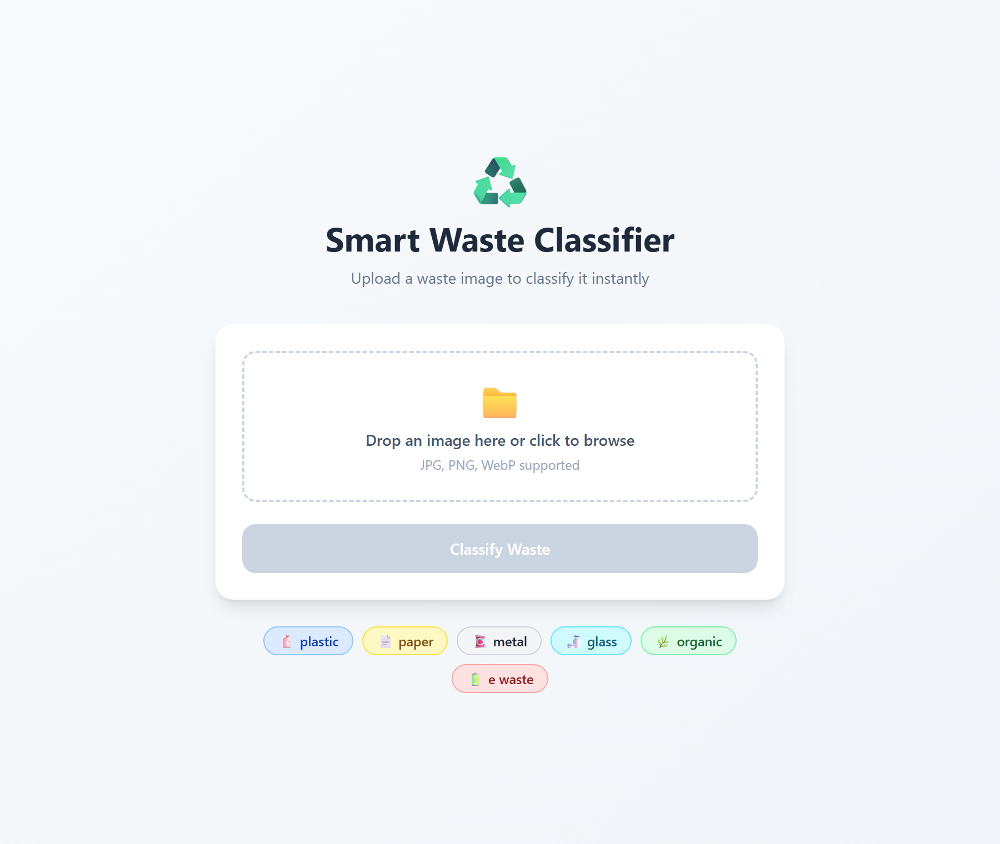
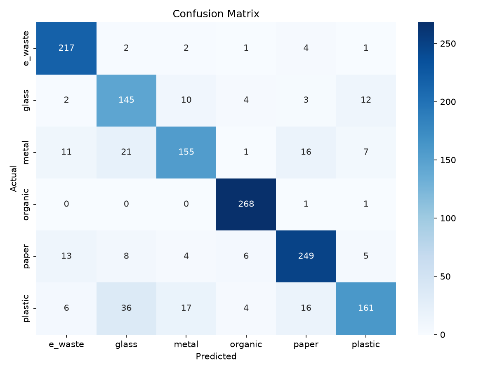

# ♻️ Smart Waste Image Classifier

Upload a photo of a piece of waste and get an instant classification into one of
six categories. The project is a full, three-tier application:

- **ML** — a ResNet‑18 transfer‑learning model trained in PyTorch.
- **Backend** — a FastAPI service that serves the trained model over HTTP.
- **Frontend** — a React + Vite + Tailwind single‑page app with drag‑and‑drop upload.

Everything is containerized and runs with a single `docker compose up`.

| Frontend | Model performance |
|----------|-------------------|
|  |  |

---

## Categories

The model predicts one of **6 classes**:

`plastic` 🧴 · `paper` 📄 · `metal` 🥫 · `glass` 🍶 · `organic` 🌿 · `e_waste` 🔋

---

## Architecture

```
Browser ──HTTP POST /predict (multipart image)──▶ FastAPI backend (:8000)
   ▲                                                     │
   │  React SPA served by nginx (:3000)                  ▼
   └──────────────────────────────────── ResNet‑18 (CPU) + softmax → {class, confidence}
```

The browser talks to the backend directly, so the backend port (`8000`) must be
reachable from the machine running the browser. The API URL is baked into the
frontend at build time via the `VITE_API_URL` build arg (default
`http://127.0.0.1:8000`).

---

## Tech stack

| Layer    | Technologies |
|----------|--------------|
| ML       | PyTorch, torchvision (ResNet‑18), scikit‑learn, matplotlib/seaborn |
| Backend  | FastAPI, Uvicorn, Pillow, torch (CPU) |
| Frontend | React 19, Vite, TypeScript, Tailwind CSS, axios |
| Ops      | Docker, docker‑compose, nginx |

---

## Project structure

```
Smart Waste Image Classifier/
├── docker-compose.yml          # Orchestrates backend + frontend
├── backend/
│   ├── Dockerfile              # CPU-only torch, non-root, healthcheck
│   ├── requirements.txt
│   ├── models/                 # waste_resnet18.pth lives here (git-ignored)
│   └── app/
│       ├── main.py             # FastAPI app: GET / and POST /predict
│       ├── model_loader.py     # Builds ResNet-18 and loads the checkpoint
│       └── predict.py          # Image transforms + inference
├── frontend/react-app/
│   ├── Dockerfile              # Multi-stage: node build → nginx serve
│   ├── nginx.conf
│   └── src/App.tsx             # Upload UI + result display
├── ml/
│   ├── requirements.txt
│   ├── src/
│   │   ├── dataset.py          # ImageFolder DataLoaders + transforms
│   │   ├── model.py            # ResNet-18 transfer-learning builder
│   │   ├── split_dataset.py    # processed/ → train/val/test (70/15/15)
│   │   ├── train.py            # Training loop (10 epochs, Adam)
│   │   └── evaluate.py         # Classification report + confusion matrix
│   ├── data/                   # raw / processed / splits (git-ignored)
│   ├── models/                 # trained weights (git-ignored)
│   └── reports/                # classification_report.txt, confusion_matrix.png
└── docs/                       # README screenshots
```

---

## Prerequisites

- **Docker Desktop** (with Compose v2) — the only requirement for the quick start.
- For local development / training instead of Docker: **Python 3.11** and **Node 20+**.
- A trained model file at **`backend/models/waste_resnet18.pth`**. This file is
  git‑ignored (≈43 MB), so a fresh clone won't include it. Either obtain it from
  the project owner or train your own (see [Training the model](#training-the-model))
  and copy it into `backend/models/`.

---

## Quick start (Docker)

From the project root:

```bash
docker compose up --build
```

Then open:

- **Frontend UI** → http://localhost:3000
- **Backend API** → http://localhost:8000 (interactive docs at http://localhost:8000/docs)

Stop and remove the containers with:

```bash
docker compose down
```

> The backend copies `backend/models/waste_resnet18.pth` into the image at build
> time, so make sure that file exists before running `docker compose up --build`.

---

## Local development (without Docker)

### Backend

```bash
cd backend
python -m venv venv
# Windows:  venv\Scripts\activate
# macOS/Linux:  source venv/bin/activate
pip install --extra-index-url https://download.pytorch.org/whl/cpu -r requirements.txt
cd app
uvicorn main:app --reload --port 8000
```

The API is now on http://localhost:8000.

### Frontend

```bash
cd frontend/react-app
npm install
npm run dev
```

Vite serves the app on http://localhost:5173 and, by default, calls the backend
at `http://127.0.0.1:8000`. To point elsewhere, create a `.env` file:

```
VITE_API_URL=http://localhost:8000
```

---

## API reference

### `GET /`
Health check. Returns the API status and the list of classes.

```json
{
  "message": "Smart Waste Classifier API is running",
  "classes": ["e_waste", "glass", "metal", "organic", "paper", "plastic"]
}
```

### `POST /predict`
Classify an uploaded image. Body is `multipart/form-data` with a single `file` field.

```bash
curl -X POST http://localhost:8000/predict -F "file=@path/to/image.jpg"
```

Response:

```json
{ "class": "plastic", "confidence": 0.9812 }
```

`confidence` is the softmax probability of the predicted class (0–1, rounded to 4 dp).

---

## Training the model

The ML scripts use paths relative to the repo root, so **run them from the project
root** (not from `ml/`).

```bash
pip install -r ml/requirements.txt
```

1. **Prepare data.** Place class‑labelled images under `ml/data/processed/<class>/`
   (one folder per class, e.g. `ml/data/processed/plastic/…`).
2. **Split** into train/val/test (70/15/15, seed 42):
   ```bash
   python ml/src/split_dataset.py
   ```
3. **Train** (ResNet‑18, frozen backbone + new classifier head, 10 epochs, Adam lr=1e‑3).
   The best checkpoint by validation accuracy is saved to `ml/models/waste_resnet18.pth`:
   ```bash
   python ml/src/train.py
   ```
4. **Evaluate** on the test split — writes the report and confusion matrix to `ml/reports/`:
   ```bash
   python ml/src/evaluate.py
   ```
5. **Deploy** the new weights to the backend:
   ```bash
   cp ml/models/waste_resnet18.pth backend/models/waste_resnet18.pth
   ```

---

## Model performance

Evaluated on the held‑out test split (1,409 images). **Overall accuracy: 85%.**

| Class    | Precision | Recall | F1   | Support |
|----------|-----------|--------|------|---------|
| e_waste  | 0.87      | 0.96   | 0.91 | 227     |
| glass    | 0.68      | 0.82   | 0.75 | 176     |
| metal    | 0.82      | 0.73   | 0.78 | 211     |
| organic  | 0.94      | 0.99   | 0.97 | 270     |
| paper    | 0.86      | 0.87   | 0.87 | 285     |
| plastic  | 0.86      | 0.67   | 0.75 | 240     |
| **weighted avg** | **0.85** | **0.85** | **0.85** | **1409** |

See [`ml/reports/confusion_matrix.png`](docs/confusion_matrix.png) for the full
confusion matrix.

---

## License

This project is provided as‑is for educational purposes.
